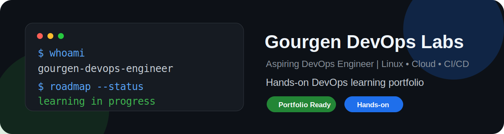

  

<h1 align="center">Gourgen DevOps Labs</h1>

  <strong>Step-by-step hands-on DevOps learning labs and portfolio projects.</strong>

  
  
  
  

---

## Goal

Become a strong DevOps Engineer by learning and practicing:

* Linux
* Networking with CCNA-level foundations
* Git and GitHub
* Bash scripting
* Database fundamentals for DevOps
* Nginx and systemd
* Docker
* GitHub Actions CI/CD
* Cloud infrastructure
* Terraform
* Monitoring and Security
* Kubernetes
* Professional portfolio building

---

## Current Phase

**Phase 1: Linux Fundamentals**

Current focus:

* Linux file system
* Absolute and relative paths
* File and directory operations
* Log reading basics

---

## Learning Method

Each topic includes:

| Step | Description                  |
| ---- | ---------------------------- |
| 1    | Explanation                  |
| 2    | Practical commands           |
| 3    | Lab task                     |
| 4    | Troubleshooting              |
| 5    | Quiz                         |
| 6    | Git commit                   |
| 7    | GitHub push                  |
| 8    | Review before moving forward |

---

## Repository Structure

| Folder                           | Purpose                                                               |
| -------------------------------- | --------------------------------------------------------------------- |
| `00-setup`                       | Local DevOps workspace setup                                          |
| `01-linux-basics`                | Linux fundamentals                                                    |
| `02-networking-ccna-foundations` | Networking fundamentals with CCNA-level foundations                   |
| `03-git-github`                  | Git and GitHub workflows                                              |
| `04-bash-scripting`              | Automation with Bash                                                  |
| `05-database-fundamentals`       | SQL, PostgreSQL, backups, restore, migrations and database operations |
| `06-nginx-systemd`               | Web server, reverse proxy and Linux services                          |
| `07-docker`                      | Containers and Docker workflows                                       |
| `08-github-actions-cicd`         | CI/CD pipelines                                                       |
| `09-cloud`                       | Cloud infrastructure                                                  |
| `10-terraform`                   | Infrastructure as Code                                                |
| `11-monitoring-security`         | Monitoring, logging and security                                      |
| `12-kubernetes`                  | Kubernetes fundamentals                                               |
| `13-portfolio`                   | Professional DevOps portfolio                                         |

---

## Security Rule

Passwords, API keys, SSH private keys and secrets must never be stored in this repository.

If a secret is accidentally committed, it must be removed from the code and rotated immediately.

---

## Portfolio Direction

This repository will grow from basic training labs into professional portfolio-ready DevOps projects.

Final labs will include:

* clear objectives
* commands
* validation steps
* troubleshooting notes
* diagrams
* screenshots
* security notes
* lessons learned

