<div align="center">

# 🚀 Gourgen DevOps Professional Roadmap

### From zero to production-ready DevOps skills through hands-on labs, bilingual documentation, and portfolio projects.


</div>

---

## 🧭 Roadmap Mission

This repository is a structured, hands-on DevOps learning roadmap focused on building real operational skills.

The goal is not only to learn commands, but to build a professional portfolio that demonstrates practical ability in:

```text
Linux → Networking → Git → Bash → Databases → Nginx/systemd → Docker → CI/CD → Cloud → Terraform → Monitoring/Security → Kubernetes → Portfolio
```

Every lesson is documented in two versions:

| File | Purpose |
|---|---|
| `notes.md` | Clean English portfolio documentation |
| `notes.hy.md` | Armenian learning and explanation version |

---

## 🔥 Current DevOps Command Center

| Item | Current Value |
|---|---|
| 🎯 Current Phase | **02 — Networking with CCNA-Level Foundations** |
| 📘 Current Lesson | **Lesson 01 — Networking Basics** |
| 🧪 Current Lesson Status | **Planned** |
| ✅ Recently Completed | **Lesson 12 — Linux Review Lab** |
| 🐧 Completed Major Phase | **Phase 01 — Linux Fundamentals** |
| 🗂️ Roadmap Source of Truth | `ROADMAP.md` |
| 🌍 Documentation Style | English portfolio notes + Armenian explanation notes |
| 🏗️ Future Docs Site | MkDocs Material or Docusaurus with real English / Հայերեն tabs |

---

## 📊 Progress Snapshot

| Area | Progress | Status |
|---|---:|---|
| Workspace Setup | `██████████` 100% | ✅ Completed |
| Linux Fundamentals | `██████████` 100% | ✅ Completed |
| Networking Foundations | `░░░░░░░░░░` 0% | 🟡 In Progress |
| Remaining DevOps Roadmap | `░░░░░░░░░░` Planned | ⚪ Planned |

---

## 🏁 Phase Status Legend

| Icon | Status | Meaning |
|---|---|---|
| ✅ | Completed | Lesson or phase finished, quiz passed, committed and pushed |
| 🟡 | In Progress | Currently being studied, documented, or validated |
| ⚪ | Planned | Planned for a later roadmap stage |
| 🧪 | Lab | Practical portfolio-ready validation project |
| 🔐 | Security | Security-sensitive topic or best-practice checkpoint |
| 🚀 | Portfolio | Project intended to strengthen GitHub portfolio presentation |

---

## 🗺️ Roadmap Overview

| Phase | Topic | Status | Outcome |
|---:|---|---|---|
| 00 | Setup and Local DevOps Workspace | ✅ Completed | Local WSL + GitHub foundation |
| 01 | Linux Fundamentals | ✅ Completed | Linux admin and troubleshooting foundation |
| 02 | Networking with CCNA-Level Foundations | 🟡 In Progress | Network, DNS, ports, routing, firewall basics |
| 03 | Git and GitHub Workflows | ⚪ Planned | Professional Git workflow |
| 04 | Bash Scripting | ⚪ Planned | Automation scripts |
| 05 | Database Fundamentals for DevOps | ⚪ Planned | PostgreSQL operations and backups |
| 06 | Nginx and systemd | ⚪ Planned | Web server + service management |
| 07 | Docker | ⚪ Planned | Containerized application stack |
| 08 | CI/CD Pipelines and GitOps | ⚪ Planned | GitHub Actions, GitLab CI/CD, Jenkins, Argo CD |
| 09 | Cloud Infrastructure | ⚪ Planned | VM deployment and cloud networking |
| 10 | Terraform | ⚪ Planned | Infrastructure as Code |
| 11 | Monitoring, Logging and Security | ⚪ Planned | Observability and hardening |
| 12 | Kubernetes | ⚪ Planned | Container orchestration |
| 13 | Professional Portfolio | ⚪ Planned | Final presentation and documentation site |

---

## ⚡ Visual Learning Flow

> A cleaner staged roadmap view for GitHub.  
> Completed work is marked in green, the current phase is highlighted in blue, and future phases remain neutral.

```mermaid
flowchart TB
    classDef completed fill:#1f883d,stroke:#2ea043,color:#ffffff,stroke-width:2px
    classDef current fill:#0969da,stroke:#58a6ff,color:#ffffff,stroke-width:3px
    classDef planned fill:#30363d,stroke:#8b949e,color:#f0f6fc,stroke-width:1.5px
    classDef project fill:#8250df,stroke:#a371f7,color:#ffffff,stroke-width:2px

    Start(["🚀 DevOps Learning Roadmap"]):::project

    subgraph Foundation["Foundation Layer"]
        P00["✅ Phase 00<br/>Setup & Workspace"]:::completed
        P01["✅ Phase 01<br/>Linux Fundamentals"]:::completed
        P02["🟡 Phase 02<br/>Networking Foundations"]:::current
    end

    subgraph Core["Core Engineering Layer"]
        P03["⚪ Phase 03<br/>Git & GitHub"]:::planned
        P04["⚪ Phase 04<br/>Bash Scripting"]:::planned
        P05["⚪ Phase 05<br/>Database Fundamentals"]:::planned
        P06["⚪ Phase 06<br/>Nginx + systemd"]:::planned
    end

    subgraph Platform["Platform & Delivery Layer"]
        P07["⚪ Phase 07<br/>Docker"]:::planned
        P08["⚪ Phase 08<br/>CI/CD + GitOps"]:::planned
        P09["⚪ Phase 09<br/>Cloud Infrastructure"]:::planned
        P10["⚪ Phase 10<br/>Terraform IaC"]:::planned
    end

    subgraph Operations["Production Operations Layer"]
        P11["⚪ Phase 11<br/>Monitoring + Security"]:::planned
        P12["⚪ Phase 12<br/>Kubernetes"]:::planned
        P13["⚪ Phase 13<br/>Professional Portfolio"]:::planned
    end

    Finish(["🏁 Production-Ready DevOps Portfolio"]):::project

    Start --> P00 --> P01 --> P02
    P02 --> P03 --> P04 --> P05 --> P06
    P06 --> P07 --> P08 --> P09 --> P10
    P10 --> P11 --> P12 --> P13 --> Finish
```



### 🧩 Roadmap Layers

| Layer | Purpose | Status |
|---|---|---|
| Foundation Layer | Workspace, Linux, networking fundamentals | 🟡 In Progress |
| Core Engineering Layer | Git workflow, Bash automation, databases, Nginx/systemd | ⚪ Planned |
| Platform & Delivery Layer | Docker, CI/CD, cloud, Terraform | ⚪ Planned |
| Production Operations Layer | Monitoring, security, Kubernetes, portfolio polish | ⚪ Planned |

---

## 📚 Table of Contents

- [Phase 00 — Setup and Local DevOps Workspace](#phase-00--setup-and-local-devops-workspace)
- [Phase 01 — Linux Fundamentals](#phase-01--linux-fundamentals)
- [Phase 02 — Networking with CCNA-Level Foundations](#phase-02--networking-with-ccna-level-foundations)
- [Phase 03 — Git and GitHub Workflows](#phase-03--git-and-github-workflows)
- [Phase 04 — Bash Scripting](#phase-04--bash-scripting)
- [Phase 05 — Database Fundamentals for DevOps](#phase-05--database-fundamentals-for-devops)
- [Phase 06 — Nginx and systemd](#phase-06--nginx-and-systemd)
- [Phase 07 — Docker](#phase-07--docker)
- [Phase 08 — CI/CD Pipelines and GitOps](#phase-08--cicd-pipelines-and-gitops)
- [Phase 09 — Cloud Infrastructure](#phase-09--cloud-infrastructure)
- [Phase 10 — Terraform](#phase-10--terraform)
- [Phase 11 — Monitoring, Logging and Security](#phase-11--monitoring-logging-and-security)
- [Phase 12 — Kubernetes](#phase-12--kubernetes)
- [Phase 13 — Professional Portfolio](#phase-13--professional-portfolio)
- [Final Portfolio Projects](#final-portfolio-projects)
- [Documentation System](#documentation-system)
- [Git Workflow Rule](#git-workflow-rule)
- [Current Progress Summary](#current-progress-summary)
- [Roadmap Maintenance Rule](#roadmap-maintenance-rule)

---

# Phase 00 — Setup and Local DevOps Workspace


<details open>
<summary><strong>✅ Lesson 00.01 — Local Workspace Setup</strong></summary>

**Status:** Completed

**Topics Covered:**

- Windows + WSL2 Ubuntu
- Linux user environment
- DevOps workspace structure
- Git installation
- Git global config
- GitHub SSH connection
- Repository initialization
- First commit and push

**Outcome:** A working local DevOps workspace connected to GitHub.

</details>

---

# Phase 01 — Linux Fundamentals


> ✅ Phase 01 is fully completed.  
> This phase builds the Linux foundation required for real DevOps work.

| # | Lesson | Status | Core Skills |
|---:|---|---|---|
| 01 | Linux File System | ✅ Completed | `/`, `/home`, `/etc`, `/var/log`, `/tmp`, WSL filesystem |
| 02 | Linux Paths | ✅ Completed | absolute paths, relative paths, `.`, `..`, `~`, `pwd` |
| 03 | File Operations | ✅ Completed | `touch`, `mkdir`, `cp`, `mv`, `rm`, `cat`, redirects |
| 04 | Log Reading Basics | ✅ Completed | `cat`, `less`, `head`, `tail`, `tail -f`, `wc -l` |
| 05 | Search and Filtering | ✅ Completed | `grep`, `find`, pipes, filtering logs and files |
| 06 | Permissions and Ownership | ✅ Completed | `chmod`, `chown`, `755`, `644`, `600`, secret permissions |
| 07 | Users, Groups and sudo | ✅ Completed | `whoami`, `id`, `groups`, `sudo`, UID/GID, least privilege |
| 08 | Processes and System Monitoring | ✅ Completed | `ps`, `top`, `htop`, `kill`, `uptime`, `free`, `df`, `du` |
| 09 | Package Management | ✅ Completed | `apt update`, `install`, `remove`, `purge`, `autoremove` |
| 10 | Linux Services Basics | ✅ Completed | `systemctl`, start/stop/restart, enable/disable, `journalctl` |
| 11 | Environment Variables | ✅ Completed | `$PATH`, `printenv`, `export`, `.bashrc`, safe secrets |
| 12 | Linux Review Lab | ✅ Completed | full Linux fundamentals review and portfolio cleanup |

## 🧪 Phase 01 Final Lab

**Lesson 12 — Linux Review Lab** combines:

```text
filesystem + paths + files + logs + search + permissions + users + processes + packages + services + environment variables
```

**Result:** Linux Fundamentals is portfolio-ready.

---

# Phase 02 — Networking with CCNA-Level Foundations


> 🟡 Current phase.  
> This phase builds the networking foundation needed for servers, cloud, Docker, Kubernetes, firewalls, DNS, and troubleshooting.

| # | Lesson | Status | Topics |
|---:|---|---|---|
| 01 | Networking Basics | ⚪ Planned | network concept, LAN, WAN, client/server, IP, gateway, DNS, ports |
| 02 | IP Addressing | ⚪ Planned | IPv4, private/public IP, subnet mask, CIDR, gateway, loopback |
| 03 | DNS Basics | ⚪ Planned | domain names, A, CNAME, MX, TXT, `nslookup`, `dig` |
| 04 | Ports and Protocols | ⚪ Planned | TCP, UDP, HTTP, HTTPS, SSH, DNS, common ports |
| 05 | Network Troubleshooting | ⚪ Planned | `ping`, `curl`, `wget`, `ss`, `netstat`, `traceroute`, `ip addr`, `ip route` |
| 06 | Firewalls and Basic Rules | ⚪ Planned | inbound/outbound traffic, `ufw`, allow/deny rules, port security |
| 07 | Networking Review Lab | ⚪ Planned | DNS troubleshooting, port checks, HTTP/SSH checks, firewall workflow |

---

# Phase 03 — Git and GitHub Workflows


| # | Lesson | Status | Topics |
|---:|---|---|---|
| 01 | Git Fundamentals | ⚪ Planned | repository, working tree, staging area, commits, `git status`, `git add`, `git commit`, `git log` |
| 02 | Branches | ⚪ Planned | branches, `git branch`, `git checkout`, `git switch`, merge basics |
| 03 | Remote Repositories | ⚪ Planned | origin, remote URL, `git push`, `git pull`, `git fetch`, upstream branch |
| 04 | Pull Requests | ⚪ Planned | PR workflow, code review, merge commits, squash merge, GitHub UI |
| 05 | Git Troubleshooting | ⚪ Planned | undo changes, restore files, reset basics, merge conflicts, recovery |
| 06 | Professional Git Workflow Lab | ⚪ Planned | feature branch, clean commits, PR, review, merge, portfolio workflow |

---

# Phase 04 — Bash Scripting


| # | Lesson | Status | Topics |
|---:|---|---|---|
| 01 | Bash Script Basics | ⚪ Planned | shebang, executable scripts, variables, echo, comments |
| 02 | Arguments and Input | ⚪ Planned | `$1`, `$2`, `$@`, `read`, input validation |
| 03 | Conditions | ⚪ Planned | `if`, `else`, `elif`, test expressions, file/string/numeric checks |
| 04 | Loops | ⚪ Planned | `for`, `while`, loop over files, safe loops |
| 05 | Functions | ⚪ Planned | function syntax, reusable logic, return codes |
| 06 | Bash Automation Lab | ⚪ Planned | log checker, backup script, disk checker, service checker |

---

# Phase 05 — Database Fundamentals for DevOps


| # | Lesson | Status | Topics |
|---:|---|---|---|
| 01 | SQL Basics | ⚪ Planned | database, table, row, column, SELECT, INSERT, UPDATE, DELETE |
| 02 | PostgreSQL Setup | ⚪ Planned | install PostgreSQL, users, databases, roles, `psql` |
| 03 | Database Permissions | ⚪ Planned | users, grants, privileges, least privilege |
| 04 | Backup and Restore | ⚪ Planned | `pg_dump`, restore, backup validation, safe restore workflow |
| 05 | Migrations Basics | ⚪ Planned | schema changes, migration files, rollback concept |
| 06 | PostgreSQL DevOps Lab | ⚪ Planned | create database/user, permissions, backup, restore, documentation |

---

# Phase 06 — Nginx and systemd


| # | Lesson | Status | Topics |
|---:|---|---|---|
| 01 | Nginx Basics | ⚪ Planned | web server concept, install Nginx, default site, config files |
| 02 | Nginx Server Blocks | ⚪ Planned | server block, domain config, root directory, index file, config test |
| 03 | Reverse Proxy | ⚪ Planned | `proxy_pass`, backend app, headers, localhost ports, troubleshooting |
| 04 | systemd Services | ⚪ Planned | unit files, service start/restart, enable on boot, `journalctl` |
| 05 | SSL Basics | ⚪ Planned | HTTPS, certificates, Let's Encrypt, Certbot, redirect HTTP to HTTPS |
| 06 | Nginx + systemd Portfolio Lab | ⚪ Planned | app service, reverse proxy, logs, restart workflow, validation |

---

# Phase 07 — Docker


| # | Lesson | Status | Topics |
|---:|---|---|---|
| 01 | Docker Basics | ⚪ Planned | container, image, Dockerfile, registry, Docker Hub, lifecycle |
| 02 | Running Containers | ⚪ Planned | `docker run`, `docker ps`, `docker stop`, `docker logs`, ports, volumes |
| 03 | Dockerfile | ⚪ Planned | base image, copy files, dependencies, expose port, command, build |
| 04 | Docker Compose | ⚪ Planned | compose file, services, networks, volumes, environment variables |
| 05 | Docker Troubleshooting | ⚪ Planned | logs, failed builds, port conflicts, volumes, networking |
| 06 | Dockerized Application Stack Lab | ⚪ Planned | app, database, Nginx, Compose workflow, documentation |

---

# Phase 08 — CI/CD Pipelines and GitOps


> This phase covers the most important CI/CD tools for DevOps engineers: **GitHub Actions, GitLab CI/CD, Jenkins, and Argo CD**.

| # | Lesson | Status | Topics |
|---:|---|---|---|
| 01 | CI/CD Basics | ⚪ Planned | CI, CD, pipeline, workflow, job, step, deployment safety |
| 02 | GitHub Actions | ⚪ Planned | `.github/workflows`, YAML, triggers, jobs, runners, actions, secrets |
| 03 | GitLab CI/CD | ⚪ Planned | `.gitlab-ci.yml`, stages, jobs, runners, artifacts, variables |
| 04 | Jenkins | ⚪ Planned | Jenkins server, agents, plugins, Jenkinsfile, credentials |
| 05 | Argo CD and GitOps | ⚪ Planned | GitOps, desired state, Kubernetes sync, Argo CD UI, rollback |
| 06 | CI/CD Pipeline Portfolio Lab | ⚪ Planned | tool comparison, automated validation, build/deploy simulation, GitOps concept |

## 🔁 CI/CD Tool Learning Order

```text
1. GitHub Actions  → GitHub-native CI/CD foundation
2. GitLab CI/CD    → full DevOps platform pipelines
3. Jenkins         → enterprise CI/CD and Jenkinsfile workflows
4. Argo CD         → GitOps deployment model for Kubernetes
```

---

# Phase 09 — Cloud Infrastructure


| # | Lesson | Status | Topics |
|---:|---|---|---|
| 01 | Cloud Basics | ⚪ Planned | provider, regions, zones, compute, storage, network, billing awareness |
| 02 | Virtual Machines | ⚪ Planned | create VM, SSH, firewall rules, public IP, Linux server setup |
| 03 | Cloud Networking | ⚪ Planned | VPC, subnets, firewall, public/private access, ports |
| 04 | Cloud Deployment | ⚪ Planned | app on VM, Nginx, systemd service, domain, SSL |
| 05 | Cloud Cost Safety | ⚪ Planned | free tier, budgets, alerts, stopping resources, billing safety |
| 06 | Cloud VM Portfolio Lab | ⚪ Planned | VM provisioning, SSH, firewall, Nginx, SSL, deployment docs |

---

# Phase 10 — Terraform


| # | Lesson | Status | Topics |
|---:|---|---|---|
| 01 | Infrastructure as Code | ⚪ Planned | IaC, Terraform basics, providers, resources, state |
| 02 | Terraform Project Structure | ⚪ Planned | `main.tf`, `variables.tf`, `outputs.tf`, `.tfvars`, formatting |
| 03 | Terraform Commands | ⚪ Planned | `init`, `plan`, `apply`, `destroy`, `fmt`, `validate` |
| 04 | Variables and Outputs | ⚪ Planned | input variables, output values, locals, reusable configuration |
| 05 | Terraform Cloud Resource Lab | ⚪ Planned | provision VM, firewall rule, output IP, safe destroy, docs |

---

# Phase 11 — Monitoring, Logging and Security


| # | Lesson | Status | Topics |
|---:|---|---|---|
| 01 | Linux Monitoring Basics | ⚪ Planned | CPU, RAM, disk, uptime, load average, `top`, `htop`, `free`, `df`, `du` |
| 02 | Logs Deep Dive | ⚪ Planned | `/var/log`, `journalctl`, auth logs, app logs, log filtering, rotation |
| 03 | Uptime Kuma | ⚪ Planned | uptime monitoring, HTTP/TCP checks, status pages, notifications |
| 04 | Netdata | ⚪ Planned | real-time server dashboard, CPU/RAM/disk/network monitoring |
| 05 | Prometheus Basics | ⚪ Planned | metrics, targets, scrape, time-series data, `prometheus.yml` |
| 06 | Node Exporter | ⚪ Planned | Linux metrics, CPU, memory, disk, filesystem, network |
| 07 | Grafana Dashboards | ⚪ Planned | datasource, dashboards, panels, Prometheus queries |
| 08 | Alerts | ⚪ Planned | alert rules, CPU/disk/uptime/service alerts, notifications |
| 09 | Zabbix Intro | ⚪ Planned | server, agent, hosts, items, triggers, templates, enterprise monitoring |
| 10 | Cloud Monitoring Tools | ⚪ Planned | Google Cloud Monitoring, AWS CloudWatch, Azure Monitor |
| 11 | Basic Security Hardening | ⚪ Planned | users, sudo, permissions, updates, SSH hardening, firewall |
| 12 | SSH Security | ⚪ Planned | SSH keys, disable root login, password risks, `sshd_config` |
| 13 | Firewall and Fail2ban | ⚪ Planned | `ufw`, open ports, allow/deny rules, Fail2ban, SSH protection |
| 14 | Monitoring and Security Portfolio Project | ⚪ Planned | Prometheus, Node Exporter, Grafana, Uptime Kuma, alerts, hardening |

---

# Phase 12 — Kubernetes


| # | Lesson | Status | Topics |
|---:|---|---|---|
| 01 | Kubernetes Basics | ⚪ Planned | cluster, node, pod, deployment, service, namespace |
| 02 | kubectl Basics | ⚪ Planned | `kubectl get`, `describe`, `logs`, `apply`, `delete` |
| 03 | Deployments and Services | ⚪ Planned | deployment YAML, service YAML, scaling, rolling updates |
| 04 | ConfigMaps and Secrets | ⚪ Planned | ConfigMap, Secret, environment variables, safe configuration |
| 05 | Kubernetes Troubleshooting | ⚪ Planned | pod errors, image pull errors, crash loop, logs, events |
| 06 | Kubernetes Portfolio Lab | ⚪ Planned | deploy app, service, config, logs, troubleshooting, documentation |

---

# Phase 13 — Professional Portfolio


| # | Lesson | Status | Topics |
|---:|---|---|---|
| 01 | Portfolio Repository Cleanup | ⚪ Planned | README quality, folder structure, badges, links, screenshots |
| 02 | Documentation Site | ⚪ Planned | MkDocs Material or Docusaurus, English/Հայերեն tabs, navigation |
| 03 | Architecture Diagrams | ⚪ Planned | network flows, CI/CD flows, monitoring/cloud architecture |
| 04 | Final Portfolio Projects | ⚪ Planned | Linux admin, Docker, CI/CD, cloud, Terraform, monitoring, security |
| 05 | Resume and GitHub Presentation | ⚪ Planned | GitHub profile, project descriptions, resume bullets, LinkedIn, interviews |

---

# Final Portfolio Projects

| # | Project | Includes |
|---:|---|---|
| 01 | Linux Server Administration Lab | users, groups, permissions, logs, services, monitoring basics, security notes |
| 02 | Networking Troubleshooting Lab | DNS, ports, curl, ping, firewall, routing basics |
| 03 | PostgreSQL DevOps Lab | PostgreSQL setup, users, permissions, backups, restore, documentation |
| 04 | Dockerized Application Stack | app container, database container, Nginx, Docker Compose, logs, troubleshooting |
| 05 | CI/CD Pipeline Lab | GitHub Actions, GitLab CI/CD, Jenkins, Argo CD, checks, builds, deploy simulation, GitOps |
| 06 | Cloud VM Deployment Lab | cloud VM, SSH, firewall, Nginx, systemd, SSL, deployment validation |
| 07 | Terraform Infrastructure Lab | Terraform project, provider, resources, variables, outputs, safe destroy |
| 08 | Monitoring and Security Stack | Prometheus, Node Exporter, Grafana, Uptime Kuma, Netdata, Zabbix, alerts, security checklist |

---

# Documentation System

For every lesson:

```text
notes.md    = English portfolio version
notes.hy.md = Armenian learning version
```

Each lesson should include:

- badges
- overview
- learning objectives
- commands learned
- lab structure
- practical commands used
- detailed explanations
- common mistakes
- quick reference
- validation
- quiz review
- quiz result
- troubleshooting notes
- Git workflow
- what I learned
- final status

Final status format:

```text
Lesson completed, quiz passed, committed and pushed to GitHub.
```

---

# Git Workflow Rule

After every completed lesson:

```bash
cd ~/devops-labs
git status
git add <lesson-folder> ROADMAP.md
git commit -m "Clear professional commit message"
git push
git status
```

Expected final result:

```text
nothing to commit, working tree clean
```

---

# Current Progress Summary

| # | Lesson / Phase | Status |
|---|---|---|
| 00 | Setup | ✅ Completed |
| 01 | Linux File System | ✅ Completed |
| 02 | Linux Paths | ✅ Completed |
| 03 | File Operations | ✅ Completed |
| 04 | Log Reading | ✅ Completed |
| 05 | Search and Filtering | ✅ Completed |
| 06 | Permissions and Ownership | ✅ Completed |
| 07 | Users, Groups and sudo | ✅ Completed |
| 08 | Processes and Monitoring | ✅ Completed |
| 09 | Package Management | ✅ Completed |
| 10 | Linux Services Basics | ✅ Completed |
| 11 | Environment Variables | ✅ Completed |
| 12 | Linux Review Lab | ✅ Completed |
| 02.01 | Networking Basics | ⚪ Planned |

---

# Roadmap Maintenance Rule

`ROADMAP.md` is the source of truth for the full DevOps learning path.

At the end of every completed lesson, update:

- current lesson status
- phase status if needed
- lesson status inside the phase
- Current Progress Summary
- next lesson status when starting it

Then commit the lesson folder and `ROADMAP.md` together.

Example:

```bash
cd ~/devops-labs
git status
git add 01-linux-basics/lesson-12-linux-review-lab ROADMAP.md
git commit -m "Complete Linux fundamentals review lab"
git push
git status
```

Expected final result:

```text
nothing to commit, working tree clean
```

---

<div align="center">

## 🚀 DevOps Roadmap Direction

**Learn deeply. Practice hands-on. Document professionally. Build portfolio projects.**

`Linux` → `Networking` → `Git` → `Bash` → `Databases` → `Nginx` → `Docker` → `CI/CD` → `Cloud` → `Terraform` → `Monitoring` → `Kubernetes`

</div>
